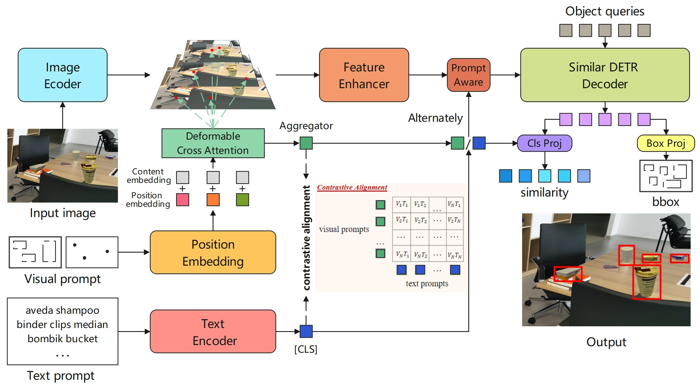
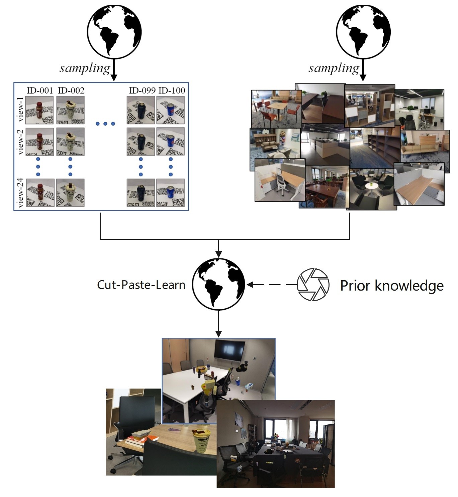

<div align="center">
  <h2>Object Instance Detection Challenge @ CVPR2025</h2>
  
</div>

<div align="center">
  <div align="left" style="display: inline-block; text-align: left;"></div>
</div>

## Introduction
[Object Instance Detection Challenge @ CVPR2025](https://eval.ai/web/challenges/challenge-page/2478/overview)

Organized by: InsDet

Starts on: Mar 24, 2025 8:00:00 AM CST (GMT + 8:00)  

Ends on: Jun 11, 2025 7:59:59 PM CST (GMT + 8:00)  

Instance Detection (InsDet) is a practically important task in robotics applications, e.g., elderly-assistant robots 
need to fetch specific items from a cluttered kitchen, micro-fulfillment robots for the retail need to pick items from 
mixed boxes or shelves. Different from Object Detection (ObjDet) detecting all objects belonging to some predefined classes, 
InsDet aims to detect specific object instances defined by some examples capturing the instance from multiple views.

This challenge focuses on the recently introduced InsDet dataset, which is larger in scale and more challenging than 
existing InsDet datasets. The major strengths of our InsDet dataset includes(1) both high-resolution profile images 
of object instances and high-resolution testing images from more realistic indoor scenes, simulating real-world indoor 
robots locating and recognizing object instances from a cluttered indoor scene in a distance 
(2) a realistic unified InsDet protocol to foster the InsDet research.

Participants in this challenge will be tasked with predicting the bounding boxes for each given instance from 
testing images. This exciting opportunity allows researchers, students, and data scientists to apply their expertise 
in computer vision and machine learning to address instance detection problem. We refer participants to the 
[user guide](https://docs.google.com/document/d/15R-R0tpKBy_KCNyc_8D45PQzHzyLmlPjDbntZJEBEYY/edit?pli=1&tab=t.0#heading=h.9odybwz6sg40) for details.

## Dataset

The dataset contains 100 object instances with multi-view profile images, 200 pure background images and 160 scene images. 
Participants can download the dataset from the [InsDet dataset](https://drive.google.com/drive/folders/1rIRTtqKJGCTifcqJFSVvFshRb-sB0OzP).

* Objects. 100 different Object instances. Each profile image has a resolution of 3072×3072 pixels (some instances are 3456×3456). 
Each instance is captured at 24 rotation positions (every 15° in azimuth) with a 45° elevation view.
* Background. 200 high-resolution background images of indoor scenes that do not include any given instances from Objects.
* Scenes. 160 high-resolution images (6144×8192) in cluttered scenes, where some instances are placed in reasonable locations. 
We tag these images as easy or hard based on scene clutter and object occlusion levels.


## Model Overview


### Declaration
This project is built on [ovdino](https://github.com/wanghao9610/OV-DINO)

## Getting Started
Copy the project code yourself.

### 1. Installation
```bash

cd cvpr-InstDet
export root_dir=$(realpath ./)

# create conda env for ov-dino
conda create -n cvpr-InstDet -y
conda activate cvpr-InstDet
conda install pytorch==1.13.1 torchvision==0.14.1 torchaudio==0.13.1 pytorch-cuda=11.6 -c pytorch -c nvidia -y
conda install gcc=9 gxx=9 -c conda-forge -y # Optional: install gcc9
python -m pip install -e detectron2-717ab9
pip install -e ./
```
 
### 2. Data Preparing
We synthesize instance detection samples using a Cut-Paste-Learn approach with target and background images. 
Initially, we gather information about image targets in real scenarios (including size, category combinations, etc.).
Subsequently, we randomly sample targets of different categories and angles, scales, and paste them onto background
images. The corresponding annotation information includes target coordinates and category text information. We have
constructed 7680 image samples. The sample synthesis process is shown as follow.



We provide a demo dataset in datas/InstDet_demo

You can refer to this demo dataset to build your own dataset. 
And you need to configure the model training and evaluation dataset path information, 
please refer to the configs/dataset_cfg/grounding_pt_insdet2025_demo.json file

```json
{
  "train": [
    {
      "root": "your_cvpr2025-InstDet_path/datas/InstDet_demo/images_train/",
      "anno": "your_cvpr2025-InstDet_path/datas/InstDet_demo/annotations/instances_train.json",
      "data_name": "coco_val2017",
      "data_type": "det",
      "anno_protocol": "coco"
    }
  ],
  "val": [
    {
      "root": "your_cvpr2025-InstDet_path/datas/InstDet_demo/images_val/",
      "anno": "your_cvpr2025-InstDet_path/datas/InstDet_demo/annotations/instances_val.json",
      "data_name": "InsDet2025",
      "data_type": "det",
      "anno_protocol": "coco"
    }
  ]
}
```

### 2. Model Preparing
* download [bert-base-uncased](https://huggingface.co/google-bert/bert-base-uncased/tree/main)
* download [swin_base_patch4_window12_384_22k.pth](https://github.com/microsoft/Swin-Transformer)

Then you need to configure the 'text_encoder' and 'backbone_path' parameters in the configs/model_cfg/ovdino_V0_swinb384_bert_base_pt_24ep.py file.
Such as:
```python
text_encoder = 'your_path/bert-base-uncased/'
backbone_path = 'your_path/swin_base_patch4_window12_384_22k.pth'

```

### 3. Training
Make sure the training dataset path parameter is configured in configs/dataset_cfg/grounding_pt_insdet2025_demo.json, 
and then execute the following command

```shell
python pretrain_V0_insdet2025.py --output_dir your_output_path/
```

### 4. Evaluation
After model training is completed, model evaluation is performed. 
Make sure the validate dataset path parameter is configured in configs/dataset_cfg/grounding_pt_insdet2025_demo.json, 
and then execute the following command

```shell
pretrain_V0_insdet2025.py --output_dir your_output_path --eval --pretrain_model_path your_output_path/checkpoint.pth
```